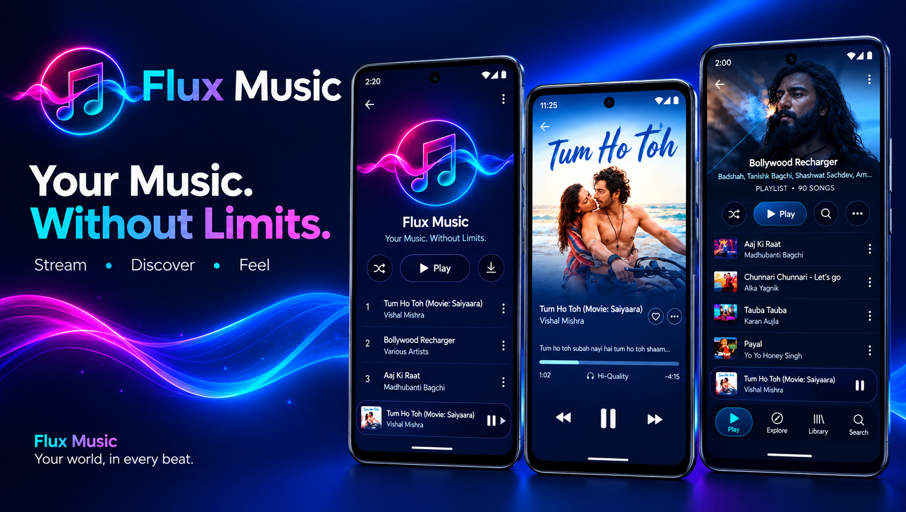

<div align="center">

<br/>


<br/>
<br/>

# Flux Music

### **Your Music. Without Limits.**
#### Next-Gen Open-Source Android Music Streaming Client

<br/>

[](https://www.android.com)
[](https://kotlinlang.org)
[](https://developer.android.com/jetpack/compose)
[](https://developer.android.com/media/media3)
[](#-download)
[](LICENSE)
[](https://github.com/Kanaiya-rgb/Flux-Music/stargazers)

<br/>

[**✨ Features**](#-features) • [**📸 Screenshots**](#-screenshots) • [**⬇️ Download**](#-download) • [**🔧 Build**](#-build-from-source) • [**🛠 Tech Stack**](#-tech-stack) • [**❤️ Credits**](#-credits--special-thanks) • [**📜 License**](#-license)

<br/>

</div>

> [!NOTE]
> **Flux Music** is a free, open-source Android music player that streams from **YouTube Music** and **JioSaavn** — completely ad-free, with no account required. Designed for audiophiles who want a premium listening experience without compromise.

---

<div align="center">



</div>

---

## ✨ Features

<table>
  <tr>
    <td width="50%" valign="top">

### 🎧 Playback & Audio Engine
- **Dual Streaming Engine** — YouTube Music (Innertube) + JioSaavn with seamless auto-fallback between sources.
- **Lossless / Hi-Res Audio** — Full FLAC, ALAC, and high-bitrate Opus streams.
- **Gapless Playback & Crossfade** — Smooth 0–12s adjustable crossfade between tracks.
- **Automix DSP [BETA]** — Native C++ beat-detection and tempo analyzer for DJ-style auto-transitions.
- **Skip Silence** — Automatically trims silent gaps longer than 1 second.
- **Spatial Audio** — Stereo widening for a more immersive, concert-like feel.
- **Offline Downloads** — Save any track with embedded artwork, ID3 tags, and lyrics. Wi-Fi-only option included.
- **Background Playback** — Full lock-screen controls, Android 13+ media notification, and home-screen widget support.

### 🎤 Synchronized Lyrics
- **Word-by-Word Highlight** — Real-time synced lyrics light up as each word is sung.
- **6 Animation Styles** — Fade, Glow, Slide, Karaoke, Apple Music-style, or None.
- **Tap-to-Seek** — Tap any lyric line to instantly jump to that moment in the song.
- **Auto-Scroll** — Lyrics follow along automatically during playback.
- **Multiple Sources** — LrcLib, KuGou, and embedded track tags with automatic fallback.
- **Translation Support** — View translated lyrics side-by-side.

### 📊 Nerd Stats & Song Inspector
- **Technical Info** — Live views, Likes & Dislikes (via Return YouTube Dislike API), Codec, Bitrate, Sample Rate, MIME type, Itag, Loudness (dB), File Size.
- **Structured Credits** — Clearly separated: Singers, Lyricists, Composers, Album details.
- **Tap-to-Copy** — Tap any field to copy it instantly.
- **Zero-Lag** — Cached in-memory, opens in under 0ms.

    </td>
    <td width="50%" valign="top">

### 🎨 Design & Aesthetics
- **Apple Music-Inspired UI** — Frosted glass, translucent navigation bars, and rich Material 3 typography.
- **Dynamic Artwork Palettes** — Auto-generated mesh-gradient backgrounds tailored to each album cover.
- **Live Canvas & Motion Art** — Video and animated backdrops during playback for immersive sessions.
- **Customizable Player Slider** — Default, Wavy, Slim, or Squiggly styles.
- **Player Backgrounds** — Gradient, Dynamic Blur, or Follow Theme modes.
- **Multiple Color Themes** — Dark, Light, System, Pure Black (AMOLED).
- **High Refresh Rate** — 90Hz / 120Hz display support for ultra-smooth animations.

### ⚡ Discovery & Library
- **Smart Home Feed** — Adaptive, personalized discovery that rotates every launch based on your likes, history, and trending genres.
- **Guest Mode** — Full discovery without signing into any account.
- **YouTube Music Sign-In** — Sync your library, liked songs, and playlists.
- **Spotify Canvas** — Watch animated Spotify canvases on compatible tracks.
- **Discord Rich Presence** — Show your current track on your Discord profile in real-time.
- **Last.fm Scrobbling** — Auto-scrobble every listen to your Last.fm profile.

### ⚙️ Customization & Controls
- **App Language** — English, Hindi, Spanish, French, German, Portuguese, Indonesian, Japanese, Russian, Chinese (Simplified).
- **Import / Export Data** — Backup your full settings and listening history as a JSON file.
- **Listening Replay** — View your top songs, artists, albums, and genres.
- **Don't Repeat Songs** — AutoPlay won't suggest an already-played track this session.
- **Swipe Art to Skip** — Swipe the album art to skip to the next or previous song.
- **Volume Bar Toggle**, **Mini Player style**, **Grid Size**, **Slim Navbar** — and many more fine-grained controls.

    </td>
  </tr>
</table>

---

## 📸 Screenshots

<div align="center">

| Home / Queue | Now Playing | Synced Lyrics | Playlist / Library |
|:-:|:-:|:-:|:-:|
| *Browse queue & songs* | *Full-screen player with artwork* | *Karaoke-style glow lyrics* | *Playlist & track management* |

> 📱 **Real app screenshots are shown in the Banner above.** All screens run live — no mockups, no fakes.

</div>

---

## ⬇️ Download

<div align="center">

### 🚀 Latest Release — `v1.5`

[](https://github.com/Kanaiya-rgb/Flux-Music/releases/latest)

</div>

> [!IMPORTANT]
> Flux Music is distributed as a **sideloaded APK** (not on Play Store). You need to enable **"Install from Unknown Sources"** on your Android device before installing.

### 📲 Installation Steps

1. Tap the **Download APK** button above, or go to [Releases](https://github.com/Kanaiya-rgb/Flux-Music/releases/latest).
2. On your phone: **Settings → Security → Install Unknown Apps** → allow your browser or file manager.
3. Open the downloaded `.apk` file and tap **Install**.
4. Open **Flux Music** and enjoy! 🎵

> [!TIP]
> Flux Music has a **built-in auto-updater** — when a new release is published on GitHub Releases, the app will notify you and let you download & install the update directly from within the app.

---

## 🔧 Build from Source

### Prerequisites

| Tool | Required Version |
|---|---|
| Android Studio | Hedgehog 2023.1.1+ |
| JDK | 17 or higher |
| Android SDK | API 34+ |
| Kotlin | 2.3.x |
| Gradle | 8.x |
| NDK | r27+ (for native C++ DSP analyzer) |

### 1. Clone the Repository

```bash
git clone https://github.com/Kanaiya-rgb/Flux-Music.git
cd Flux-Music
```

### 2. Open in Android Studio

Open the cloned folder directly in **Android Studio**. Let Gradle sync automatically.

### 3. Build the APK

```bash
# Linux / macOS — Debug build
./gradlew assembleProdDebug

# Linux / macOS — Release build (unsigned)
./gradlew assembleProdRelease
```

```powershell
# Windows — Debug build
.\gradlew.bat assembleProdDebug

# Windows — Release build (unsigned)
.\gradlew.bat assembleProdRelease
```

### 4. Locate the Built APK

| Build Type | Output Path |
|---|---|
| **Debug** | `app/build/outputs/apk/prod/debug/app-prod-debug.apk` |
| **Release (unsigned)** | `app/build/outputs/apk/prod/release/app-prod-release-unsigned.apk` |

### 5. Sign the Release APK

```bash
# Sign with your own keystore
apksigner sign \
  --ks your-keystore.jks \
  --ks-pass pass:YOUR_PASSWORD \
  --key-pass pass:YOUR_KEY_PASSWORD \
  --out Flux-Music-v1.5.apk \
  app/build/outputs/apk/prod/release/app-prod-release-unsigned.apk
```

```powershell
# Windows — using debug keystore (for testing only)
& "C:\Users\<you>\AppData\Local\Android\Sdk\build-tools\35.0.0\apksigner.bat" sign `
  --ks "$env:USERPROFILE\.android\debug.keystore" `
  --ks-pass pass:android `
  --out Flux-Music-v1.5.apk `
  app\build\outputs\apk\prod\release\app-prod-release-unsigned.apk
```

### 6. Publish a GitHub Release

1. Go to your repo → **Releases** (right sidebar) → **Draft a new release**.
2. Create tag: `v1.5` — Target: `main`.
3. Title: `Flux Music v1.5 — Stable`.
4. Drag-and-drop your signed `.apk` as a release asset.
5. Add release notes and click **Publish release**.
6. Users can now download directly from your GitHub releases page! ✅

---

## 🛠 Tech Stack

| Layer | Technology |
|---|---|
| **Language** | Kotlin 2.3 |
| **UI Framework** | Jetpack Compose + Material Design 3 |
| **Audio / Media** | Media3 ExoPlayer |
| **Dependency Injection** | Hilt (Dagger) |
| **Networking** | OkHttp 4 + Kotlinx Serialization (JSON) |
| **Image Loading** | Coil 3 |
| **Blur / Glassmorphism** | Haze |
| **Native DSP Analyzer** | C++ via CMake (beat-detection, tempo analysis) |
| **Stream Extraction** | NewPipe Extractor (YouTube Music) |
| **Spotify Module** | Custom Kotlin module |
| **Concurrency** | Kotlin Coroutines + Flow |
| **Persistence** | Room (SQLite) + DataStore (Preferences) |
| **Lyrics Sources** | LrcLib, KuGou, Embedded ID3 tags |
| **Build Tools** | Gradle 8 + AGP 8.10 + R8 8.13 |

---

## 🤝 Contributing

Contributions are welcome and appreciated! Here's how to get started:

1. **Fork** this repository.
2. **Create** a feature branch: `git checkout -b feature/my-cool-feature`.
3. **Commit** your changes: `git commit -m "Add: my cool feature"`.
4. **Push** to your fork: `git push origin feature/my-cool-feature`.
5. **Open a Pull Request** on GitHub and describe your changes.

> [!NOTE]
> Please keep code consistent with the existing style (Kotlin + Jetpack Compose). Ensure the app builds without errors before opening a PR.

**Ideas for contributions:**
- 🐛 Bug fixes and crash reports
- 🌐 New language translations (`app/src/main/res/values-xx/strings.xml`)
- 🎨 UI polish and new theme options
- 🎵 New lyrics / streaming source integrations
- 📱 Widget improvements

---

## ❤️ Credits & Special Thanks

Flux Music is proudly built on the shoulders of these incredible open-source projects:

<table>
  <tr>
    <td align="center" width="50%">
      <a href="https://github.com/kushagrasinghx/BitChord">
        <h3>🎵 BitChord</h3>
      </a>
      <p>by <strong><a href="https://github.com/kushagrasinghx">@kushagrasinghx</a></strong></p>
      <p>Core player UI architecture, Automix DSP integration (native C++), Spotify Canvas support, and the foundational aesthetic design system that powers Flux Music's player experience.</p>
      <a href="https://github.com/kushagrasinghx/BitChord">
        
      </a>
    </td>
    <td align="center" width="50%">
      <a href="https://github.com/FrancescoGrazioso/Meld">
        <h3>⚡ Meld</h3>
      </a>
      <p>by <strong><a href="https://github.com/FrancescoGrazioso">@FrancescoGrazioso</a></strong></p>
      <p>Dynamic personalized recommendation engine, real-time adaptive discovery feeds, appearance customization system, and the sleek Song Details / Nerd Stats inspector architecture.</p>
      <a href="https://github.com/FrancescoGrazioso/Meld">
        
      </a>
    </td>
  </tr>
</table>

### Additional Acknowledgments

| Library / Service | Purpose |
|---|---|
| [NewPipe Extractor](https://github.com/TeamNewPipe/NewPipeExtractor) | YouTube Music stream parsing & metadata extraction |
| [Return YouTube Dislike API](https://returnyoutubedislikeapi.com/) | Live dislike counts in the Song Inspector |
| [Haze](https://github.com/chrisbanes/haze) | High-performance frosted glass blur for Jetpack Compose |
| [LrcLib](https://lrclib.net/) | Synchronized & plain-text lyrics provider |
| [Last.fm API](https://www.last.fm/api) | Scrobbling support & listening history |
| [Coil](https://coil-kt.github.io/coil/) | Fast, lightweight image loading for Kotlin/Compose |

---

## ⚖️ Disclaimer & Legal Notice

Flux Music is an **independent, community-driven** third-party audio client. It is **not** affiliated with, endorsed by, or associated with:
- Google LLC or YouTube Music
- JioSaavn or Reliance Industries
- Spotify AB
- Any other referenced third-party service

**Key points:**
- 📦 **No Media Hosting** — Flux Music does not host, store, or redistribute any copyrighted content. It accesses streams via publicly available APIs.
- 🎓 **Personal & Educational Use** — Intended strictly for personal, educational, and fair-use purposes.
- ⚠️ **User Responsibility** — Users are solely responsible for complying with their local laws and the terms of service of third-party platforms.

---

## 📜 License

<div align="center">

This project is licensed under the **GNU General Public License v3.0 (GPLv3)**.

See the [LICENSE](LICENSE) file for complete terms.

<br/>

[](https://github.com/Kanaiya-rgb/Flux-Music/stargazers)
[](https://github.com/Kanaiya-rgb/Flux-Music/network/members)
[](https://github.com/Kanaiya-rgb/Flux-Music/issues)
[](https://github.com/Kanaiya-rgb/Flux-Music/releases/latest)

<br/>

*Stream. Discover. Feel. — Made with ❤️ by [Kanaiya-rgb](https://github.com/Kanaiya-rgb)*

<br/>

</div>
